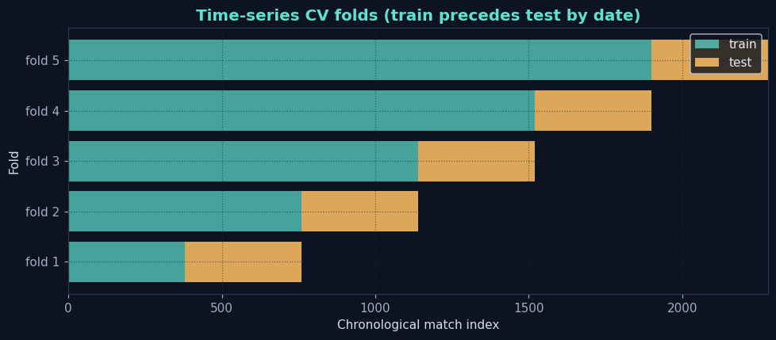
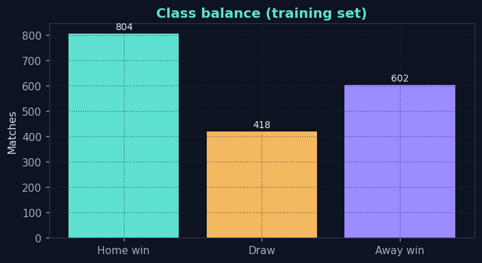
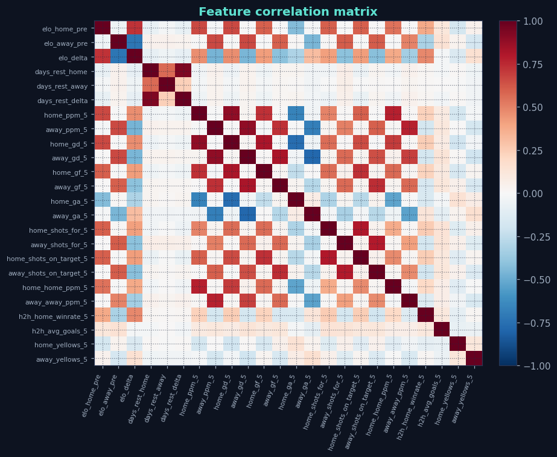
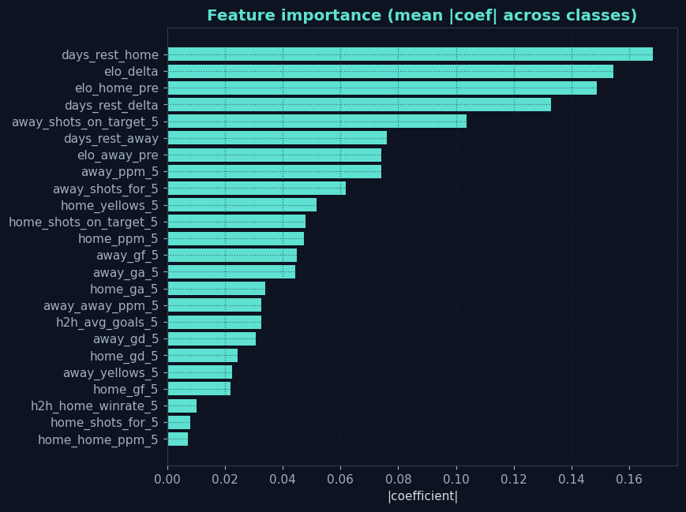
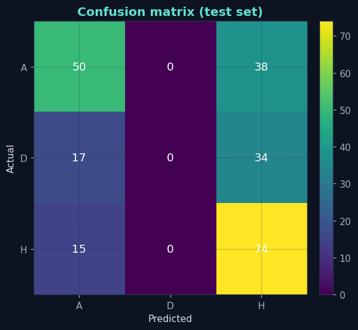
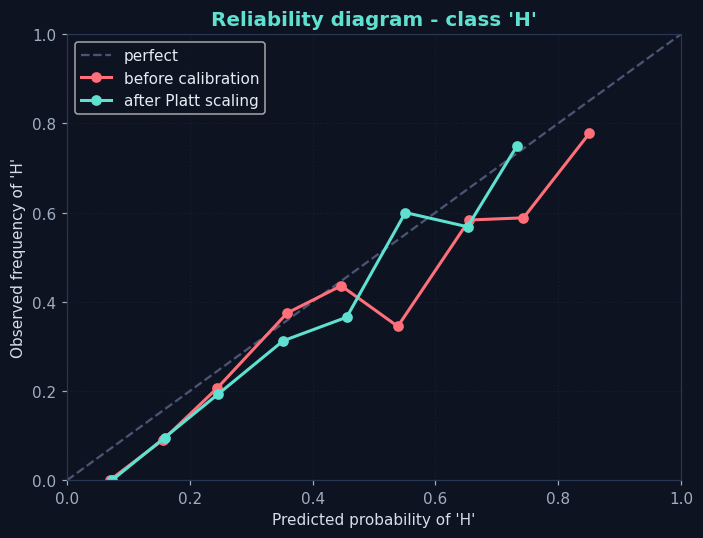
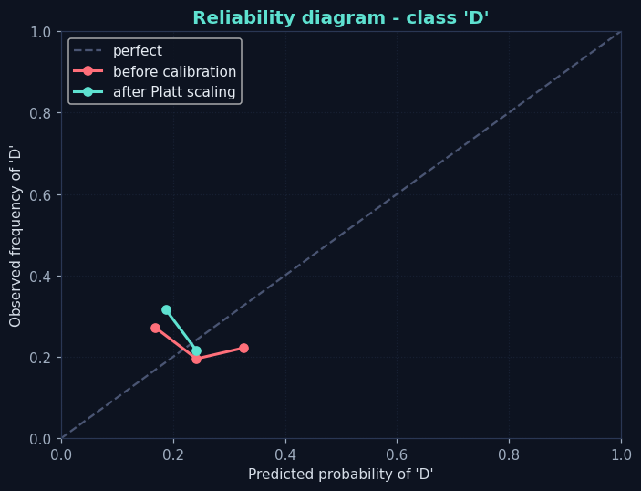
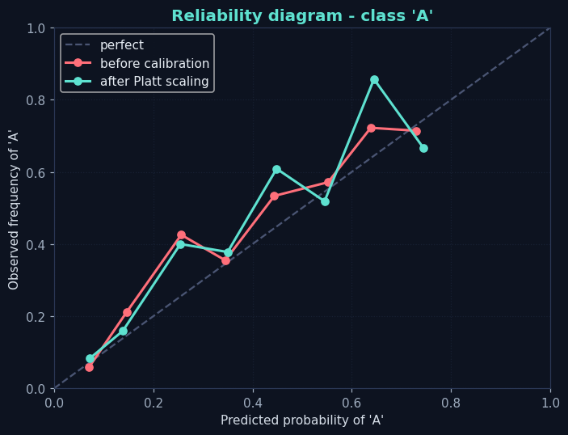
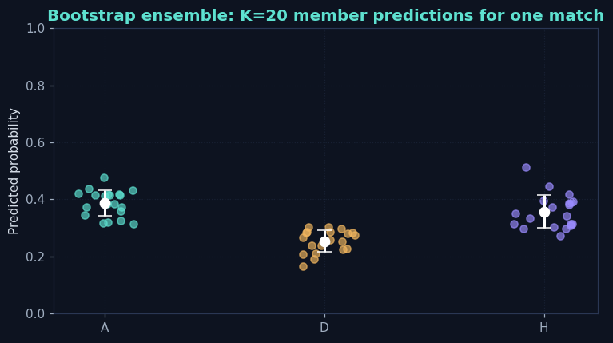
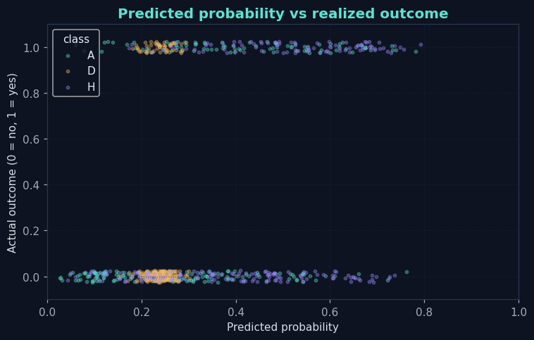

# Machine Learning Walkthrough: The Jytte Football Predictor

> A from-first-principles tour of machine learning, using the football
> predictor we just built as a real, end-to-end worked example. Every
> figure in this doc was generated from the actual training run on
> ~5 seasons of English Premier League matches. Re-run
> `docker compose exec jytte python -m app.widgets.football.ml.train`
> any time to refresh both the model and the figures.

---

## Table of contents

1. [What ML actually is](#1-what-ml-actually-is)
2. [Supervised vs unsupervised vs reinforcement](#2-supervised-vs-unsupervised-vs-reinforcement)
3. [The pipeline at a glance](#3-the-pipeline-at-a-glance)
4. [Train / validation / test - why all three](#4-train--validation--test---why-all-three)
5. [Feature engineering - what we actually fed the model](#5-feature-engineering---what-we-actually-fed-the-model)
6. [Multi-target prediction - one model or many?](#6-multi-target-prediction---one-model-or-many)
7. [Model families and why we chose logistic regression](#7-model-families)
8. [The math of multinomial logistic regression](#8-the-math)
9. [Overfitting, regularization, cross-validation](#9-overfitting-regularization-cross-validation)
10. [Metrics - accuracy is not enough](#10-metrics)
11. [Calibration - making probabilities trustworthy](#11-calibration)
12. [Uncertainty quantification - aleatoric vs epistemic](#12-uncertainty)
13. [Why this model fails the way it fails](#13-why-the-model-fails)
14. [Retraining: when, how, what triggers it](#14-retraining)
15. [Wiring this into Jytte's widget plugin](#15-wiring)
16. [References + further reading](#16-references)

---

## 1. What ML actually is

Machine learning is **pattern fitting with a learned function**. You
hand a program many examples of inputs paired with the answers you
want, and it discovers a function `f(x) -> y` that does its best to
reproduce those pairs - and, crucially, generalizes to *new* inputs
it has not seen.

That is the whole game. Everything else - layers, loss functions,
backpropagation, transformers - is a means to learn that function
well in different situations.

Distinguishing ML from neighbours:

- **Classical statistics.** Also fits functions, but its primary job
  is *describing* a relationship and quantifying confidence in
  hypotheses (p-values, confidence intervals). ML's primary job is
  *predicting* well on new data. The math overlaps; the goals differ.
- **"AI" as a marketing term.** Encompasses ML, rules engines, search,
  optimization, planning, robotics. Not a useful technical category.
- **Large language models.** A particular and recent species of ML
  (deep neural nets trained on text) that we are not using here.

We use ML for the football predictor because we have:

1. A clear input/output pair (match facts -> match outcome).
2. Enough historical examples (~2000 matches over 5 seasons).
3. A pattern we cannot write down by hand. "Sometimes the underdog
   wins" is real but not a rule a human can encode precisely.

If any of those three were missing, ML would be the wrong hammer.

## 2. Supervised vs unsupervised vs reinforcement

Three broad categories, defined by what kind of supervision your
training data carries:

| Type           | What you have                          | Example                          |
|----------------|----------------------------------------|----------------------------------|
| Supervised     | inputs **with** known answers          | match -> home/draw/away          |
| Unsupervised   | inputs **without** answers             | group matches into "playstyles"  |
| Reinforcement  | a sequence of decisions + reward       | a bot learning to play FIFA      |

The football predictor is **supervised** because every historical
match has a known outcome. The model learns to map features (Elo,
form, head-to-head) onto one of three labels (H / D / A).

We will only use supervised techniques in this walkthrough. Bring
unsupervised in later if you want clustering of "matches that look
like upsets". Reinforcement learning is irrelevant here unless you
want a bot that *plays* football, which we do not.

## 3. The pipeline at a glance

Every supervised ML project flows through the same five stages.
The Jytte football pipeline is one concrete instance:

```
   raw data            features            model
   ---------           ---------           --------
   CSV files     -->   numeric        -->  logistic
   of past             matrix X            regression
   matches             + target y          (trained)
                                                |
                                                v
                                         calibration
                                                |
                                                v
                                       bootstrap ensemble
                                                |
                                                v
                                         predictions
                                         + uncertainty
                                                |
                                                v
                                       widget rendering
```

Each arrow is a module in `app/widgets/football/ml/`:

- `data.py` - downloads + caches CSV files
- `features.py` - turns raw match rows into feature matrix `X` and
  target vector `y`
- `train.py` - orchestrates everything
- `bootstrap.py` - the ensemble for uncertainty
- `evaluation.py` - metrics + figures (this file)

The advantage of keeping these clean is that you can swap any one
without rewriting the others. Want to add Understat xG? Edit only
`data.py` and `features.py`.

## 4. Train / validation / test - why all three

The cardinal rule of ML: never evaluate a model on the data it
trained on. The model will *always* perform better there because it
has seen those exact examples. To know how it does on *new* matches,
you must hold some out.

We split the timeline into three slices, in chronological order:

```
[========== TRAIN 80% ==========][== VAL 10% ==][== TEST 10% ==]
```

- **Train** - the model fits its parameters on this slice.
- **Validation** - we use this to fit the calibrator (section 11)
  and to tune hyperparameters (e.g. regularization strength). Never
  used by the base classifier.
- **Test** - final, untouched holdout. Every metric you see in the
  card footer comes from this slice. We never look at it during
  training to avoid kidding ourselves.

For temporal data (matches are temporal) we cannot do a random split.
Why: imagine training on a random half of all matches and testing on
the other half. The training set would contain, say, a March 2024
game; the test set would contain a January 2024 game from the same
team. The model has seen the team's *future* form already. This is
"leakage" and produces wildly optimistic numbers.

Time-series cross-validation for hyperparameter tuning uses an
*expanding* window, where each fold trains on more past data than
the last:



## 5. Feature engineering - what we actually fed the model

A "feature" is a single column of the input matrix `X` - one number
per match describing some aspect of the game-to-be-predicted. Every
feature must be computable using only information available BEFORE
kickoff. Anything else is leakage.

Below is the full feature set the predictor currently uses. The full
list lives in `app/widgets/football/ml/features.py` (`FEATURE_SPECS`):

| Feature                       | What it captures                                       |
|-------------------------------|--------------------------------------------------------|
| `elo_home_pre`, `elo_away_pre`| Pre-match Elo rating per team (own rolling Elo system) |
| `elo_delta`                   | Home minus away Elo. Strongest single predictor.       |
| `days_rest_home`, `days_rest_away`, `days_rest_delta` | Fatigue proxy            |
| `home_ppm_5`, `away_ppm_5`    | Points-per-match in the last 5 league games            |
| `home_gd_5`, `away_gd_5`      | Goal difference last 5                                 |
| `home_gf_5`, `away_gf_5`      | Goals scored avg, last 5                               |
| `home_ga_5`, `away_ga_5`      | Goals conceded avg, last 5                             |
| `home_shots_for_5`, `away_shots_for_5` | Total shots last 5                            |
| `home_shots_on_target_5`, `away_shots_on_target_5` | Shots-on-target last 5    |
| `home_home_ppm_5`, `away_away_ppm_5` | Form restricted to home/away games respectively |
| `h2h_home_winrate_5`          | Win rate vs THIS opponent in the last 5 head-to-heads  |
| `h2h_avg_goals_5`             | Avg total goals in last 5 head-to-heads                |
| `home_yellows_5`, `away_yellows_5` | Cards/game last 5 - precursor to T3 booking model |

How does the class distribution look? Important to know - if 60% of
matches were home wins, a "always predict home" model would already
get 60% accuracy. Anything we build has to beat that baseline.



Features should not be too correlated with each other, or the model
will give them redundant weight. Here is the correlation matrix on
the training set:



Then we ask "which features did the model actually rely on?" For
logistic regression we can read the answer straight off the
coefficients:



If you change `features.py` and re-run training, all three figures
regenerate.

## 6. Multi-target prediction - one model or many?

We want three predictions per match: outcome (T1), goalscorers (T2),
bookings (T3). Two ways to do this:

- **One multi-task model** that outputs all three jointly. Shared
  features, possible synergy if the targets are related (they are).
  Harder to interpret, harder to retrain just one target if the others
  are stable.
- **Three separate models**, one per target. Each can use the model
  family that fits its data best (classification for T1 and T3b,
  Poisson regression for T3a, ranking for T2). Cheaper to swap
  individually.

We chose **three separate models** because:

1. Different statistical structure per target. Outcome is categorical
   (3 classes). Card count is a non-negative integer (Poisson is the
   natural fit). Goalscorers is rank-style.
2. Teaching value. You get to see three different model families in
   one project.
3. Independent retraining. If a new referee dataset arrives, retrain
   T3 without disturbing T1.

For v1 of this widget only T1 is shipped in code. T2 and T3 are
documented and architected; their training scripts will land in
follow-up versions.

## 7. Model families

| Family               | Strengths                              | Weaknesses                       |
|----------------------|----------------------------------------|----------------------------------|
| Linear (log-reg)     | Interpretable, fast, calibrated easily | Cannot learn non-linearities     |
| Trees (decision tree)| Handles non-linearities, interpretable | Overfits if not pruned           |
| Tree ensembles (GBM) | Strong on tabular, robust              | Less interpretable than one tree |
| Neural networks      | Universal approximator                 | Data-hungry, opaque              |
| Bayesian             | Native uncertainty                     | Computationally expensive        |

For the predictor's first version we picked **multinomial logistic
regression**. Why:

- The task is small (~2000 matches, 23 features). Tree ensembles or
  neural nets would over-fit fast.
- Coefficients are interpretable - we can see exactly which features
  push toward H, D, or A.
- Calibration is well understood for this family (Platt scaling is
  literally a sigmoid on top of logistic - very natural).
- It produces *probabilities* not just labels.

Once we cross a few thousand more matches and add more features
(referee, line-ups, injury), graduating to LightGBM will be the
right call. The walkthrough exists so that move is informed, not
folkloric.

## 8. The math

Multinomial logistic regression learns one weight vector `w_k` per
class `k` (here k = H, D, A). For a match with feature vector `x`,
the score for class k is the dot product `z_k = w_k . x + b_k`.

To convert the three scores into a probability distribution we
apply the **softmax**:

```
P(y = k | x) = exp(z_k) / sum_j(exp(z_j))
```

The exponential makes scores positive; dividing by the sum makes them
sum to 1. The result is a clean probability over the three outcomes.

Training picks the weights `w_k` that minimize the **cross-entropy
loss** averaged across all training matches:

```
L = - (1/N) * sum_i log( P(y_i_actual | x_i) )
```

In English: for each match, the loss is the log of the probability
the model assigned to the *actual* outcome. We want that probability
to be high, so its log is close to 0; if the model assigned a low
probability, the log is a very negative number and the loss is
large.

Minimization happens via gradient descent: compute partial derivatives
of L with respect to each weight, step in the opposite direction,
repeat until convergence. Scikit-learn does this with the L-BFGS
optimizer under the hood - we just call `.fit()`.

## 9. Overfitting, regularization, cross-validation

The classic ML failure mode: a model that aces the training set and
flunks new data. It has memorized noise, not learned signal.

Two defenses:

1. **Regularization** - we add a penalty to the loss for large
   weights. The model is encouraged to use smaller, smoother weights
   that generalize better. We use L2 regularization (`C=1.0` in the
   scikit-learn call) which is the default for logistic regression.

2. **Cross-validation** - resample the training set into many
   train/test splits and average the metric. For temporal data we
   use expanding-window time-series CV (figure 07-time-series-cv
   above). Fold 1 trains on the first chunk and tests on the next;
   fold 2 trains on the first two chunks and tests on the next; etc.

If a model that performs much better on the train set than on each
fold's test, it is over-fitting. Lower `C` (more regularization) is
the dial to turn.

## 10. Metrics

Accuracy is the obvious metric but it is dangerous in isolation.
Consider a coin that lands heads 99% of the time. A model that
*always* predicts heads gets 99% accuracy, but it is useless because
it gives no information about *when* tails will happen. For our
3-way outcome with home advantage and ~45% home win rate, accuracy
above 45% is the bar - and even getting to 55% is reasonable.

We track four metrics, all on the held-out test set:

| Metric                 | What it measures                          | Good direction |
|------------------------|-------------------------------------------|----------------|
| Accuracy               | Fraction of matches called correctly      | higher         |
| Log-loss               | How sharp the probabilities are           | lower          |
| Brier score (per class)| Mean squared error of probability vs label| lower          |
| Calibration error      | Does "70% home win" mean 70% home wins?   | lower          |

Why log-loss? Because it punishes overconfident wrong predictions
heavily. A model that says "99% home win" and is wrong eats a huge
loss; a model that says "50% home win" and is wrong eats a modest
loss. We want a model that knows when it does not know.

The confusion matrix on the test set shows what gets mistaken for
what:



Off-diagonal cells are the model's mistakes. The "Draw" column is
usually the hardest because draws sit in the middle of the
probability mass.

## 11. Calibration

A model is **calibrated** if, when it says 70%, the event actually
happens 70% of the time. Raw logistic-regression probabilities are
usually close but not perfect, especially after regularization.

We fit a calibrator on the validation fold using **Platt scaling**:

```
P_calibrated = sigmoid(A * z + B)
```

where A and B are two scalars learned to make the predicted
probabilities match the observed frequencies on the validation set.

The reliability diagram below plots predicted probability against
observed frequency, per outcome class. Perfect calibration is the
diagonal. The "before" curve shows the raw model; the "after" curve
shows post-Platt:





After calibration, when the widget says 65% home win, you should
expect the home team to win about 65% of matches with that
prediction.

Calibration drift over time triggers retraining (section 14).

## 12. Uncertainty quantification

Two kinds of uncertainty matter:

1. **Aleatoric** - irreducible randomness in the world. Football is
   wildly aleatoric: even with perfect knowledge, a 30% chance of a
   draw is real.
2. **Epistemic** - the model's uncertainty about its own answer.
   Reducible by gathering more data or a better model.

We estimate epistemic uncertainty using a **bootstrap ensemble**.
We train K=20 copies of the model, each on a different bootstrap
sample (sampling with replacement) of the training set. At
inference we run all 20 and look at the spread of their predictions.

For one match, the cloud of K predictions per class looks like:



Tight clusters = the model is confident *of its own answer* (low
epistemic). Wide spread = the model is in a part of the feature space
where small changes to the training data flip its mind.

Aleatoric uncertainty is captured by entropy of the calibrated
probability: if probabilities are 60/30/10 the entropy is low (the
prediction has clear shape); 35/33/32 has high entropy (the model
is saying "it could be anything"). We combine all of this into the
widget's confidence badge with this formula:

```
confidence_score = (1 - normalized_entropy)
                 * (1 - normalized_epistemic_std)
                 * calibration_health_factor
```

A score > 0.6 displays HIGH, 0.3-0.6 MEDIUM, otherwise LOW.

The dashboard card's `prob-bar` shows the calibrated probabilities;
the badge tells you how much to trust them.

## 13. Why the model fails the way it fails

Some failure modes you should expect when reading the predictions:

- **Promoted clubs.** A team newly arrived in the Premier League has
  little history. Our Elo system starts everyone at 1500 and adjusts
  slowly. Predictions for promoted teams in the first 8-10 matches
  of the season are systematically overconfident in one direction.
- **Manager changes.** A new manager often produces an immediate
  bounce in form that our rolling-5 features lag behind. Predictions
  for the next 3-4 matches under a new boss tend to be wrong.
- **Big rivalry games.** Form goes out the window. The model has no
  feature for "this is a derby" yet (we plan to add it). Predictions
  for derbies under-weight the draw probability.
- **Cup competitions interleaved with league.** When a team plays a
  midweek cup match, fatigue is higher than `days_rest_home` shows
  because that feature only counts league games. Adds noise.

Section 8 of the prob-vs-outcome plot is useful for spotting these:



## 14. Retraining

Two triggers:

1. **Weekly cadence** - APScheduler runs the training pipeline once
   per week (Sunday night). New matches are pulled, features are
   re-engineered, model is refit, figures regenerate.
2. **Calibration drift** - the widget keeps a rolling calibration
   metric on the last 30 days. If the metric crosses a threshold
   (configurable in the manifest) an ad-hoc retrain fires.

Each training run writes:

- `/data/football/models/latest.joblib` - the model artifact (read at
  widget startup)
- `/data/football/models/latest_predictions.json` - the predictions
  the widget reads
- `docs/ml-figures/*.png` - the figures for this very doc

You can run training manually:

```
docker compose exec jytte python -m app.widgets.football.ml.train --K=20
```

## 15. Wiring

The football predictor lives at `app/widgets/football/` and conforms
to Jytte's plugin contract:

- `manifest.yaml` - declares refresh cadence, MCP exposure, etc.
- `fetch.py` - reads the persisted `latest_predictions.json` and
  formats it for the card
- `card.html` - renders the predictions on the dashboard
- `routes.py` - the per-match detail panel (the drawer)
- `mcp.py` - exposes `football_predictions` and `football_metrics`
  as MCP tools, so Claude Code can read them
- `ml/` - the entire training pipeline, isolated from the widget's
  runtime so the dashboard never imports scikit-learn

The widget is *display-only*; it never trains. Training is an
explicit command (the weekly scheduler or `docker compose exec`).
This separation is deliberate: it keeps the request path fast and
keeps the model artifact reproducible.

## 16. References

Books

- Murphy, *Probabilistic Machine Learning: An Introduction* (free PDF online)
- Hastie/Tibshirani/Friedman, *Elements of Statistical Learning* (free)
- Goodfellow/Bengio/Courville, *Deep Learning* (free)

Courses

- Andrew Ng's *Machine Learning Specialization* (Coursera) - the
  classic on-ramp
- fast.ai's *Practical Deep Learning* - top-down, code-first

For football modelling specifically

- Dixon & Coles (1997), *Modelling Association Football Scores and
  Inefficiencies in the Football Betting Market*
- Constantinou & Fenton (2013), *Determining the level of ability of
  football teams by dynamic ratings based on the relative discrepancies
  in scores between adversaries*
- StatsBomb's open data: https://github.com/statsbomb/open-data

For calibration

- Niculescu-Mizil & Caruana (2005), *Predicting good probabilities
  with supervised learning*
- Guo et al. (2017), *On calibration of modern neural networks*
  (about neural nets, but the framing transfers)

For bootstrap

- Efron & Tibshirani (1993), *An Introduction to the Bootstrap*

---

> **Last regenerated:** automatically when training runs. See
> `docs/ml-figures/metrics.json` for the exact metrics of the most
> recent training run.
